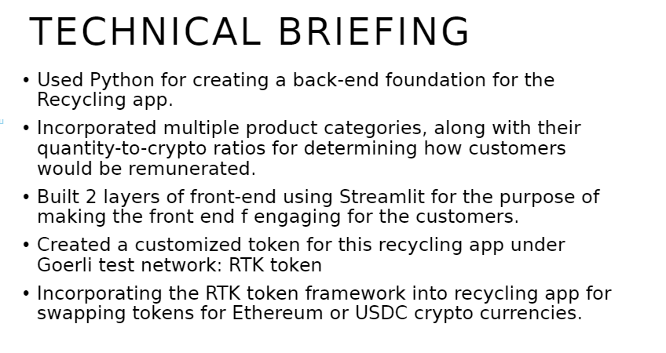

# Recycle-to-Earn 

<b>Purpose</b>: Deploying a blockchain token “RTK” to incentivize recycling and reward participants for their efforts
<b>Our goal</b>: Encourage sustainable practices and increase recycling rates

## Problem Statement

- Low recylcing rates and lack of motivation among individuals
- Landfill accumulation, pollution, and resource depletion
- Ineffective incentives and limited tracking capabilities 

## Solutions Overview

## Technical Briefing

## Furture Development Ideas

## Front-End Application: Streamlit

This shows our front-end application where users can recycle materials and earn ethereum currently based on the weight of the recycled material. Users would need to input their wallet address and the amount will be automatically calculated to be sent to the user's wallet address

## RTK Token

Users would need to install hardhat and openzepplin to enable them to deploy the RTK Token

The deployed contract is as follows:
[Etherscan Link](https://goerli.etherscan.io/address/0xFc81527762b47819ebD33A89bA31635058E61Ff9)

Additionally, we also worked with DApps such as Pancakeswap to build out a place where users can trade their ethereum or USDC to RTK or the other way around. 

In this case, we used Goerli to imitate Ethereum on the Goerli Testnetwork.

Here is the liquidity of Goerli and RTK that shows the price of RTK for each Goerli coin

Once the token is deployed, users can earn Goerli from a faucet and convert that to RTK. Here is what an RTK token looks like on MetaMask.

## Back-End Code:

We used CSS scripts to make the front-end on streamlit look appealing to the end user who would be using the platform. The back-end code also shows how transfers work and additionally added functionality to implement the RTK token onto the Streamlit platform. 

We used Solidity, openzepplin, and hardhat to deploy the contract with information as follows:

Here is the deployment script for the RTK Token:

And here is the edited hardhat config code using goerli:

